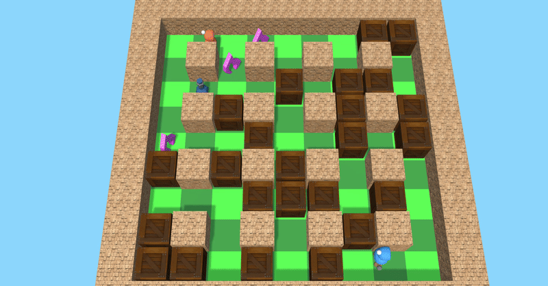

# Explosive AI



This is a client to control a player in a BomberBuddy game. The purpose is to have a competition where AI agents and algorithms try to blow each other up! However this project is in beta and probably has some bugs so please raise an issue or send me a message on the 42 slack (jbarment or ldevelle).  

<br/>


- [Explosive AI](#explosive-ai)
	- [How it works](#how-it-works)
		- [Download the game](#download-the-game)
			- [Automatic way](#automatic-way)
			- [Manual way](#manual-way)
		- [Install the Package](#install-the-package)
		- [FIGHT !](#fight-)
	- [How you can help ?](#how-you-can-help-)
	- [Thanks](#thanks)


<br/>

## How it works


### Download the game

#### Automatic way

Normally you should be able to run

```sh
./scripts/download_simulator.sh
```

<!-- And it will download you the simulator in your project directory under `./simulator/build/bomber.x86_64` -->

Unfortunatelly, `gdown` does not seems to work most of the time (do not hesitate to propose a pull request to solve this issue)


#### Manual way

First you need to download the game

- mac: [https://drive.google.com/file/d/1F5GoeN_-0d1NlI7jnxCjBKJHthOO0Bk1](https://drive.google.com/file/d/1F5GoeN_-0d1NlI7jnxCjBKJHthOO0Bk1)

- Linux: [https://drive.google.com/file/d/19j9jLHTMItYzpvW5AvbufL0z1VLRaVST](https://drive.google.com/file/d/19j9jLHTMItYzpvW5AvbufL0z1VLRaVST)

Then you need to extract it under the directory `simulator` in this project directory.

If your file has been downloaded into your `Downloads` directory you may run: 

```sh
tar -xvf ~/Downloads/bomber_linux.tar.xz -C simulator/
```

Finnaly you can had the executable rights

```sh
chmod +x simulator/build/bomber.x86_64
```

<br/>

### Install the Package

If you already installed the package you may want to start by running:

```sh
pip uninstall bomberman 
```

You may now build the wheel (the type of file that pip uses to install a package)

```sh
python -m build 
```

You may now install our beautiful package

```sh
pip install dist/bomberman-0.1.0-py3-none-any.whl
```

<br/>


### FIGHT !

You can now ***start the game*** and run fight.py with python3.

```sh
python fight.py
```

The code to `NoSuicide/Agent.py` contains what you need to know to start building an agent.  

<br/>

## How you can help ?

You can help by reporting bugs or suggesting features / improvements.  

Don't be shy to say something looks wierd or stupid or to ask for stuff (i.e I wanna be able to play against my AI)  

If you want to help dev on the project contact us at contact@42ai.fr.  

<br/>

## Thanks
Thank you for participating in the beta of this project and helping 42AI organize cool competitions in the school
